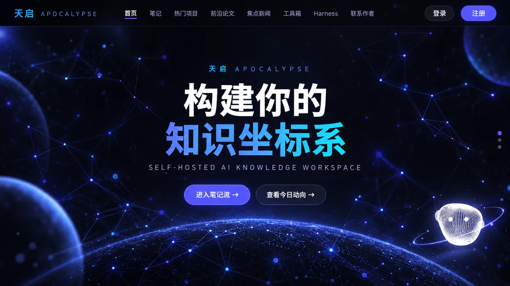

<div align="center">



# Apocalypse

**A self-hosted knowledge workspace that connects notes, papers, developer trends, news, and an inspectable AI agent.**

[简体中文](README.md) · [Quick start](#quick-start) · [Features](#feature-map) · [Roadmap](ROADMAP.md) · [Contributing](CONTRIBUTING.md) · [Issues](https://github.com/lauxian5520/Apocalypse/issues)

[](LICENSE)
[](https://www.python.org/)
[](https://fastapi.tiangolo.com/)
[](https://docs.docker.com/compose/)
[](https://github.com/lauxian5520/Apocalypse/releases)
[](https://github.com/lauxian5520/Apocalypse/stargazers)

</div>

## Why Apocalypse?

- **More than another chat box.** Notes, papers, GitHub Trending, Hugging Face models, and news live in one workflow where AI can explain and summarize page context.
- **An agent you can inspect.** Review model-visible messages, tool calls, approvals, token usage, append-only events, and complete replayable trajectories.
- **Self-hosted by design.** Run the FastAPI backend, native frontend, and SQLite storage with Docker Compose. All mutable state is contained in `var/` for simple backups.
- **Provider-neutral.** Use DeepSeek, Zhipu, Gemini, OpenAI, Ollama, or any compatible endpoint.
- **The same runtime is an RL environment.** `rl/` turns the agent into a reproducible Deep Research reinforcement-learning environment — frozen corpus, exact verifiers, leakage filtering, concurrent rollout, token-level loss masks, GRPO — with a measurement behind every design decision, including the one that overturned the first design.

If Apocalypse is useful to you, consider giving it a ⭐. It helps other developers looking for a self-hosted knowledge workspace discover the project.

## Feature map

| Knowledge inputs | AI and execution | Capture and collaboration |
|---|---|---|
| GitHub Trending, Hugging Face, arXiv, multi-source news | Streaming chat, page summaries, explanations, tool calling | Markdown notes, multi-image posts, comments, direct messages |
| Daily, weekly, and monthly feeds | Human approval, sandboxing, trajectory inspection, context compression | Local database, unified backups, admin console |
| HotpotQA frozen corpus (66,581 passages, hashed) | Agentic RL: verifiers, concurrent rollout, GRPO | The event log is the training trajectory; environment fingerprints make runs reproducible |

### Agent workbench highlights

- Replaceable model, tool registry, session store, and sandbox interfaces.
- Append-only event log as the source of truth for model-message projection.
- Fork and replay from any event; raw events are never deleted during context compression.
- Shell disabled by default, admin-only access, path containment, resource limits, and manual approval for unsafe commands.
- A three-pane workbench that fits one screen by default: drag any divider (double-click to reset), resize the composer or any tool output, or switch to wide mode. Long turns stay responsive because the inspector appends events instead of re-rendering, and reloading during a running turn reattaches to it with the interrupt button available.
- Tool arguments are parsed tolerantly — raw newlines inside a `write` payload are recovered byte-for-byte — while a call truncated by the output cap is reported as truncation, not as bad JSON.
- Per-session cost from a data-file price table keyed by the exact model string; an unpriced model is named rather than silently shown as a dash.
- Built-in offline wiring checks and live provider probes.

## Deep Research RL environment

`rl/` builds a **reproducible, offline, deterministic** multi-hop retrieval environment on top of the agent runtime. The environment, reward, and verifiers are the deliverable, and every design decision is backed by a measurement. The full design and all measurements are in [rl/README.md](rl/README.md) (Chinese); [rl/GPU_QUICKSTART.md](rl/GPU_QUICKSTART.md) goes from clone to training on a GPU box.

**The first design was measured and discarded.** It was built on a self-collected 50k-paper arXiv corpus. Retrieving a paper from its own eight rarest abstract words hit top-1 100% of the time, and still did after every corpus-rare word was removed. Difficulty has to come from confusable near-duplicates *in the corpus* — no rewording fixes that — so the environment moved to HotpotQA distractor:

| Same measurement | arXiv 50k | HotpotQA 66.6k |
|---|---|---|
| Runner-up / top BM25 score ratio (median) | 0.28 | **0.84** |
| Questions with a >0.8 competitor | 0% | **58%** |

**Leakage filtering is the step that matters most.** Nearly half the questions can be answered closed-book, and training on those rewards recall, not retrieval. The two models' leaked sets do not contain each other, so leakage is a property of the *(question, model)* pair and the filter takes the union:

```
7405 questions − 3684 answerable closed-book (49.8%) − 897 incompletely covered = 2824 kept
train 1908 · dev 457 · test 459, each frozen with a sha256
```

Every change the environment itself made to `backend/` is an addition — the `harness/corpus/` package, one tool module, and a preset with its prompt and tool contract — plus two config fields and one line in the tool registry's gate table. `agent.py`, `projection.py`, `events.py`, `context.py` and `approval.py` are unchanged. (One refactor came first: `contained_path` moved from `services/` to `core/`, because through it `harness/` had been importing FastAPI indirectly, which kept `rl/` from importing the harness at all.) The three `corpus_*` tools are gated off by default (`HARNESS_CORPUS_ENABLED=false`), so the live site's tool set is unaffected. Everything except training itself runs and self-checks on a Raspberry Pi 5.

## Quick start

### Docker Compose (recommended)

```bash
git clone https://github.com/lauxian5520/Apocalypse.git
cd Apocalypse
cp .env.example .env
docker compose up -d
```

Open <http://localhost>. The first registered account becomes the administrator. Core knowledge-space features work without an AI key; configure a cloud provider or local Ollama in `.env` to enable AI features.

### Local development

```bash
cp .env.example .env
cd backend
pip install -r requirements.txt
python main.py
```

Then open <http://localhost:8000>. Apocalypse requires Python 3.10 or later.

## Architecture

```text
rl/  ------------------>  harness        (one-way: backend/ never imports rl/)
routers  ->  services | harness  ->  models
    \-------------- all layers ------------>  core
```

- `backend/core`: configuration, storage paths, security, database, providers, SSE, and domain errors.
- `backend/services`: application logic independent from FastAPI request objects.
- `backend/harness`: event-sourced agent loop, tools, approvals, sandbox, adapters, and session projection. `harness/corpus/` holds the frozen-corpus reader and hand-written BM25 index, shared by the `corpus_*` tools and `rl/` so both see exactly the same thing.
- `rl`: the Deep Research RL environment — corpus and task pipeline, verifiers, rollout engine, evaluation, and the SFT/GRPO trainer. It sits outside `backend/` and depends only inward, which keeps torch out of the web server's import graph.
- `frontend`: dependency-light HTML, CSS, and JavaScript UI.
- `var`: the only mutable runtime directory; database, uploads, feeds, music, and agent workspaces.

For the complete architecture, security model, tool contracts, and verification commands, see the [Chinese technical documentation](README.md#-项目结构).

## Configuration

Copy `.env.example` to `.env`. The most important settings are:

| Variable | Purpose |
|---|---|
| `AI_PROVIDER` | `deepseek`, `gemini`, `zhipu`, `openai`, `ollama`, or `custom` |
| `JWT_SECRET` | Authentication and captcha signing secret; change before deployment |
| `COOKIE_SECURE` | Enable after HTTPS is configured |
| `HARNESS_REQUIRE_ADMIN` | Keep the agent workbench admin-only on public deployments |
| `HARNESS_SHELL_ENABLED` | Disabled by default; read the security model before enabling |
| `HARNESS_MAX_TOKENS` | Output cap per model call (default `8192`). Too low truncates a `write` mid-arguments, and a truncated tool call cannot be recovered |
| `HARNESS_CORPUS_ENABLED` | Exposes the `corpus_*` retrieval tools for the RL environment. Off by default; the live site is unaffected |
| `VAR_DIR` | Root directory for all mutable runtime state |

The full table, including subagent limits and context-compression budget, is in the [Chinese README](README.md) (section 配置说明).

## Verification

There is no test framework; each subsystem ships a staged self-check that runs every stage independently and exits non-zero on any failure, so it can gate a deploy script.

```bash
cd backend && python ../tools/harness_check.py --offline   # 12 local wiring stages, no tokens
cd backend && python ../tools/harness_check.py             # + real provider calls
python -m rl.checks.rl_check --offline                     # 21 RL stages, from the repo root
```

Two of the RL stages need torch and are skipped without it, so an interpreter without torch reports 19 passed and 3 skipped (the third being the real rollout, which `--offline` omits).

## Contributing and security

Bug reports, feature proposals, documentation improvements, and focused pull requests are welcome. Read [CONTRIBUTING.md](CONTRIBUTING.md) before opening a PR. Please report vulnerabilities privately as described in [SECURITY.md](SECURITY.md).

## License

MIT
